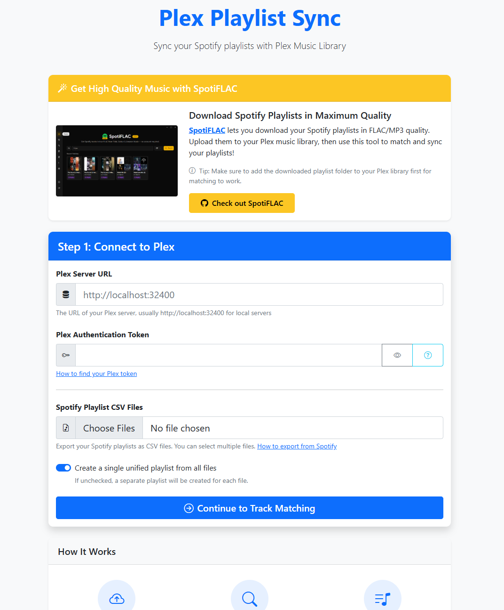

# Plex Playlist Sync

A web-based tool to sync your Spotify playlists with your Plex Music Library. Upload CSV exports from Spotify, match tracks with your Plex library, and create playlists automatically.



## Features

- **Easy CSV Upload**: Drag and drop Spotify playlist CSV exports
- **Smart Track Matching**: Fuzzy matching algorithm finds the best tracks in your Plex library
- **Multiple Playlists**: Process multiple CSV files at once, either as separate playlists or merged into one
- **Web Interface**: Clean, modern UI built with Flask and Bootstrap
- **Docker Support**: Run easily in a containerized environment

## Prerequisites

- Python 3.9+ (or Docker)
- Plex Media Server with music library
- Spotify playlist CSV export (via [Exportify](https://exportify.net/) or similar)

## Quick Start

### Option 1: Local Installation

1. Clone the repository:
```bash
git clone https://github.com/yourusername/plexsync.git
cd plexsync
```

2. Install dependencies:
```bash
pip install -r requirements.txt
```

3. Run the application:

**Windows:**
```batch
start.bat
```

**Linux/Mac:**
```bash
chmod +x start.sh
./start.sh
```

Or manually:
```bash
python app.py
```

4. Open your browser to `http://localhost:5000`

### Option 2: Docker

```bash
docker-compose up -d
```

The app will be available at `http://localhost:5000`

## How to Use

### 1. Export Your Spotify Playlist

1. Go to [Exportify](https://exportify.net/) or similar service
2. Login with your Spotify account
3. Select the playlist you want to export
4. Download as CSV

### 2. Get Your Plex Token

1. Sign in to [Plex Web](https://app.plex.tv/desktop)
2. Click your profile icon → Account Settings
3. Click **Web** in the left sidebar under Account
4. Look for `X-Plex-Token` in the URL
5. Copy everything after `X-Plex-Token=`

> ⚠️ **Security**: Keep your token private - it provides access to your Plex server!

### 3. Configure and Sync

1. Open Plex Playlist Sync in your browser
2. Enter your Plex server URL (usually `http://localhost:32400` for local)
3. Paste your Plex token
4. Upload your CSV file(s)
5. Choose whether to create unified or separate playlists
6. Review matched tracks and create your playlists!

## Want High-Quality Music? Check Out SpotiFLAC!

Before syncing, you might want to download your Spotify playlists in maximum quality. **[SpotiFLAC](https://github.com/afkarxyz/SpotiFLAC)** is a tool that lets you download Spotify playlists in FLAC/MP3 quality.

**Workflow:**
1. Use **SpotiFLAC** to download your Spotify playlists in high quality
2. Add the downloaded music folder to your Plex music library
3. Scan your Plex library to import the new tracks
4. Use **Plex Playlist Sync** to match and create playlists from your Spotify CSV exports

This gives you the best of both worlds: Spotify's curated playlists with high-quality audio files in Plex!

## Configuration

### Environment Variables

| Variable | Description | Default |
|----------|-------------|---------|
| `PORT` | Server port | 5000 |
| `FLASK_DEBUG` | Enable debug mode | 0 |
| `PLEX_BASE_URL` | Your Plex server URL | - |
| `PLEX_TOKEN` | Your Plex auth token | - |

### Docker Volume

The `uploads` folder is mounted as a volume for persistent CSV storage:

```yaml
volumes:
  - ./uploads:/app/uploads
```

## Project Structure

```
plexsync/
├── app.py                 # Main Flask application
├── plexsync.py           # Track matching logic
├── requirements.txt      # Python dependencies
├── start.bat            # Windows startup script
├── start.sh             # Linux/Mac startup script
├── Dockerfile           # Docker image definition
├── docker-compose.yml   # Docker Compose configuration
├── static/              # Static assets (CSS, JS, images)
├── templates/           # Jinja2 HTML templates
└── uploads/             # Uploaded CSV storage
```

## Dependencies

- Flask 2.x
- Flask-Session
- PlexAPI
- python-dotenv
- unidecode
- Werkzeug

See `requirements.txt` for full list and versions.

## Security Notes

- **Change the secret key** in `app.py` before deploying to production
- Use HTTPS when accessing over the internet
- Never share your Plex token
- The app includes CSRF protection and secure session handling

## Troubleshooting

### "Could not connect to Plex server"
- Verify your Plex URL is correct
- Check that your token is valid
- Ensure Plex server is running and accessible

### "No tracks found"
- Make sure your music is added to a Plex music library
- Run a library scan in Plex first
- Check CSV format matches expected columns (Track Name, Artist Name)

### Match accuracy issues
- Ensure your Plex library has good metadata
- Try refreshing metadata for problematic albums in Plex
- The matching algorithm handles minor spelling variations but needs recognizable track/artist names

## License

MIT License - see LICENSE file for details

## Acknowledgments

- [PlexAPI](https://github.com/pkkid/python-plexapi) for the Python Plex interface
- [Exportify](https://exportify.net/) for Spotify playlist export functionality
- **[SpotiFLAC](https://github.com/afkarxyz/SpotiFLAC)** for high-quality music downloads
- Bootstrap and Bootstrap Icons for the UI

## Contributing

Contributions welcome! Please open an issue or pull request.
